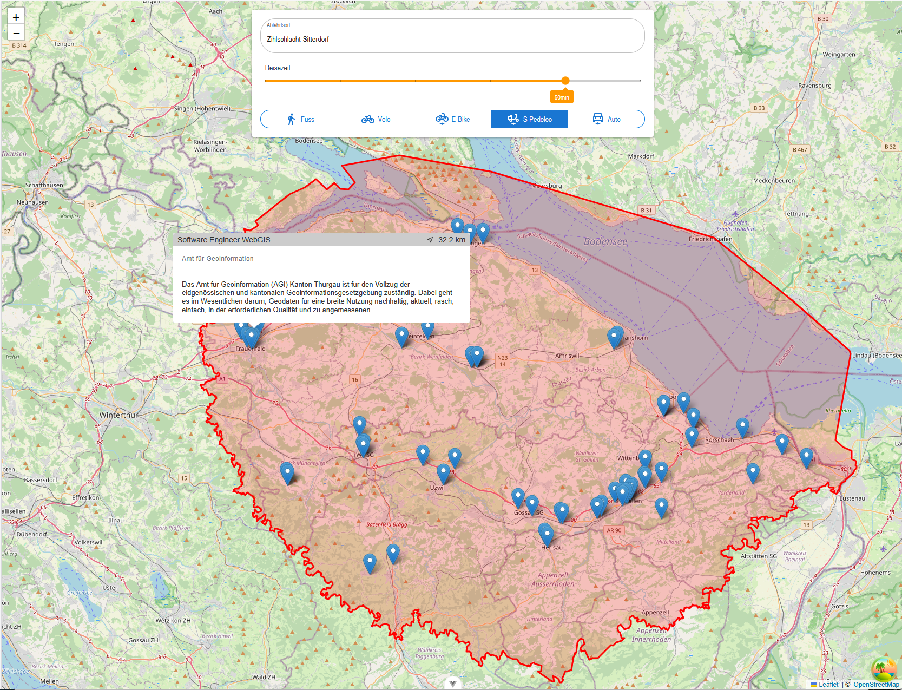
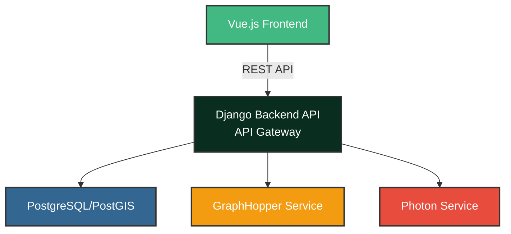

# Job-Radar: Finden, was erreichbar ist

Job-Radar ist eine moderne WebGIS-Anwendung, die die Jobsuche neu denkt. Statt einfacher Umkreissuchen visualisiert die Applikation Stellenangebote basierend auf der tatsächlichen **Reisezeit**.

Dies ermöglicht eine realistische Einschätzung der Erreichbarkeit und deckt potenzielle Jobs auf, die bei einer klassischen, distanzbasierten Suche verborgen bleiben würden.

*Beispiel: Alle erreichbaren Jobs innert 50 Minuten mit dem S-Pedelec (45 km/h)*

## Kernfunktionen

*   **Dynamische Isochronen:** Echtzeit-Visualisierung des erreichbaren Gebiets auf der Karte.
*   **Multimodale Verkehrsmittelwahl:** Berechnung für Fussgänger, Fahrrad, E-Bike, S-Pedelec und Auto.
*   **Interaktive Job-Filterung:** Die angezeigten Stellenangebote passen sich dynamisch an die gewählte Reisezeit und den Startort an.
*   **Effizientes Backend:** Ein asynchroner Prozess sammelt im Hintergrund laufend aktuelle Job-Angebote.

## Technische Architektur

Das Projekt ist als entkoppelte Anwendung mit einer klaren **API-Gateway-Architektur** konzipiert. Das Django-Backend dient als einzige Schnittstelle (Backend-for-Frontend) für den Client. Es kapselt die gesamte Geschäfts- und Service-Logik, inklusive der Anfragen an die untergeordneten Geodienste.

Dieser Ansatz vereinfacht das Frontend erheblich, erhöht die Sicherheit und ermöglicht serverseitiges Caching. Der gesamte Stack ist containerisiert, um eine konsistente Entwicklungsumgebung zu gewährleisten.

### Backend (Django API Gateway)

*   **Framework:** **Django** mit **django-ninja** für eine performante, asynchrone (ASGI) und typensichere API.
*   **Gateway-Funktion:** Das Backend stellt dem Frontend einheitliche Endpunkte zur Verfügung (z.B. `/api/isochrone`, `/api/geocode`). Intern ruft es die entsprechenden Geodienste (GraphHopper, Photon) auf, verarbeitet deren Antworten und liefert ein für den Client optimiertes JSON-Format zurück.
*   **Datenbank:** **PostgreSQL** mit **PostGIS**-Erweiterung für hochperformante räumliche Abfragen (z.B. `ST_Intersects`).
*   **API-Vertrag:** `django-ninja` generiert automatisch ein `openapi.json` Schema, das als "Single Source of Truth" für die API dient.

### Frontend (Vue.js Single-Page Application)

*   **Kommunikation:** Das Frontend kommuniziert **ausschliesslich** mit der Django-Backend-API. Es hat keine Kenntnis von den nachgelagerten Geodiensten.
*   **Framework:** Eine reaktive **Single-Page Application (SPA)**, realisiert mit **Vue.js**.
*   **API-Integration:** Der TypeScript-Client wurde **automatisiert aus der OpenAPI-Spezifikation des Backends generiert**. Dieser API-First-Workflow garantiert Typsicherheit und stellt sicher, dass das Frontend immer synchron zum API-Vertrag ist.
*   **Karten-Rendering:** **Leaflet.js** dient als leichtgewichtige Engine für die Darstellung der interaktiven Karte und der vom Backend gelieferten GeoJSON-Daten.

### Geodienste (Self-Hosted, Backend-intern)

Diese Dienste sind reine Backend-Komponenten und werden nicht direkt im Internet exponiert.
*   **Routing & Isochronen:** Eine eigene **GraphHopper**-Instanz berechnet die Erreichbarkeitspolygone.
*   **Geocoding:** Ein eigener **Photon**-Server ist für das Forward-Geocoding (Adresssuche) zuständig.

### Infrastruktur & Deployment

*   **Containerisierung:** Der gesamte Stack – Django-App, Vue-Frontend, PostgreSQL, GraphHopper und Photon – ist vollständig mit **Docker** containerisiert und wird über eine `docker-compose.yml`-Datei orchestriert. Ein einfacher `docker-compose up`-Befehl startet die gesamte Anwendung lokal.